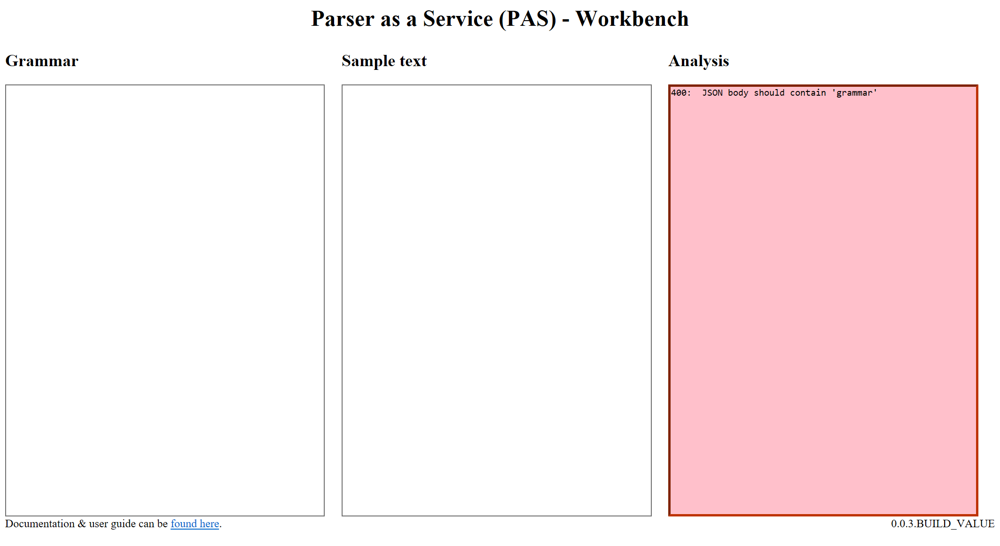

# Parser as a Service

See the [following blog article](http://todefine.com) introducing it.

Parser as a Service (PAS) is a grammar-based parser running as a REST service.  It allows you to implement Domain Specific Languages (DSLs).

A workbench is [available online](https://pasworkbench.azurewebsites.net/).  It allows us to experiment with the underlying API in an interactive manner.

Typically we would develop grammar using the workbench and then integrate application to PAS by using the API directly.

PAS is implemented in C# and deployed in Microsoft Azure, but as with most APIs, the implementation details aren't important.  This makes PAS a very easy to integrate with parsing solution.

Parser as a Service (PAS) is based on the defunct project 'M' from Microsoft, circa 2008.  The workbench takes inspiration from the three columns M editor.

[Documentation is available here](documentation/README.md).  For now, let's do a quick start.

## Implementing a simple DSL

Let's say we want to implement a simple DSL.  We want to be able to read a configuration file of the form:

```Python
location = Canada
sizes = large, medium
nastier
=
elephant
,
prince
postal-code =
 K1P1J9
```

Let's say we can describe sample texts (in English) as follow:

* It is a list of configuration, arbitrarily long
* Each configuration is of the form ```config-key = config-element1, config-element2, ...``` where
  * ```config-key``` is an identifier starting with a letter and having any alpha-numeric character or minus ('-') afterwards
  * Config elements have similar format
  * Config elements can be either one element or multiple elements separated with commas
* Configurations typically occupy different line but that isn't necessary the case

Let's try to implement this with PAS.  Let's fire up the [Workbench](https://pasworkbench.azurewebsites.net/).



The Workbench UI has three columns:  the grammar, the sample text and the analysis.  We defined the grammar in the first one, we input some sample text in the second and the third one gets populated automatically by applying the grammar on the sample text.

### Parsing a word

Let's start simple by parsing words.  Let's input the following in the *Grammar* text area:

```Python
rule main = ("a".."z")*;
```

A grammar is a set of rules.  The *main* rule is the one that gets fire to parse text, but it can refer to other rules in more complex scenarios.

Here our grammar stipulate that anything between "a" and "z" is ok and can be repeated (arbitrarily long).  The '*' marks the repetition.

and let's type ```test``` in the *Sample Text* area.  The *Analysis* should display the following:

```JSON
200:  {
  "apiVersion": "0.0.92.72",
  "ruleMatch": {
    "rule": "main",
    "text": "test",
    "repeats": [
      {
        "text": "t"
      },
      {
        "text": "e"
      },
      {
        "text": "s"
      },
      {
        "text": "t"
      }
    ]
  }
}
```

The sample ```test``` does match our grammar:  it is a repetition of letters.

The **200** at the beginning of the analysis simply indicates the API HTTP status code.  **200** is HTTP for OK.

The ``ruleMatch`` element contains parsing information.  It is a hierarchical representation of the match that occured.  At the first level, we see the rule ``main`` was the one doing the match on the text ``test``.  We then see via the element ``repeats`` each sub rule that was fired.  The sub rule doesn't have a name so we only see the text it matched, i.e. each letter.  The main rule was ``("a".."z")*``.  The sub rule was ``"a".."z"``.

Let's keep going.  If we change the *Sample Text* for ``TEST``, we'll see the *Analysis* turn red with the following message:

```JSON
400:  Text cannot be matched by grammar
```

This is because our grammar recognizes only lower-case letters.  Let's fix that:

```Python
rule main = ("a".."z" | "A".."Z")+;
```

We did a few modifications.

First we changed the '\*' for a '+'.  '+' indicates repeats of one or more while '\*' indicates repeats of **zero** or more.  That means '\*' accepts empty strings, which we do not want in this case.

Second we included upper case letters.  We use '|' to separate both lower-case and upper-case rule.  It basically is a 'or':  either upper-case or lower-case.

We can now parse ``TEST`` but also ``TesT``.

### Multiple rules

We would need to model identifiers, i.e. strings starting with a letter but following with either letter, numbers or '-'.  We could cram that into one rule, but let's use multiple rules:

```Python
rule alpha = "a".."z" | "A".."Z";
rule alphaNumeric = alpha | "0".."9" | "-";
rule main = alpha alphaNumeric*;
```

The first rule defines letters-only while the second leverages the first and adds numbers and '-'.

The main rule builds a *sequence*, i.e. different rules following each other:  first we match a letter then we match a repeat of alpha-numeric characters.  Notice we went back to '\*' since we force to have one character (a letter) first.

We can now match text such as ``test``, ``test2``, ``Test3-4`` but not ``6test`` (which starts with a numeric).

We notice something interesting in the *Analysis* area:

```JSON
200:  {
  "apiVersion": "0.0.92.75",
  "ruleMatch": {
    "rule": "main",
    "text": "TEST-2"
  }
}
```

### Tagging

We do not get the details of the sub rule.  That is because the main rule now is a sequence.

We can force the main rule to give us the breakdown by changing it to ``rule main = a:alpha an:alphaNumeric*;``.

This will give us the following *Analysis*:

```JSON
200:  {
  "apiVersion": "0.0.92.77",
  "ruleMatch": {
    "rule": "main",
    "text": "TEST-2",
    "fragments": [
      {
        "tag": "a",
        "match": {
          "rule": "alpha",
          "text": "T"
        }
      },
      {
        "tag": "an",
        "match": {
          "text": "EST-2",
          "repeats": [
            {
              "rule": "alphaNumeric",
              "text": "E"
            },
            {
              "rule": "alphaNumeric",
              "text": "S"
            },
            {
              "rule": "alphaNumeric",
              "text": "T"
            },
            {
              "rule": "alphaNumeric",
              "text": "-"
            },
            {
              "rule": "alphaNumeric",
              "text": "2"
            }
          ]
        }
      }
    ]
  }
}
```

We used **tags**.  We tagged the rule, saying we were interested to get the content of the first rule match in a fragment named *a* (for *alpha*) and the content of the second rule match in a fragment named *an* (for *alpha numeric*).

We can therefore control the verbosity of the analysis returned by the API.  Some parser will have special keywords for those, refering to *tokens* for the rules returning no details.  PAS threat them just as rules and we can define where we want details.  In general we want to breakdown where we need the sub information.  In this case, having each character individually is just noise.

### Extracting information

We now have the knowledge to build a simple DSL:

```Python
rule alpha = "a".."z" | "A".."Z";
rule alphaNumeric = alpha | "0".."9" | "-";
rule identifier = alpha alphaNumeric*;

rule main = key:identifier "=" element:identifier
```

With this grammar we can recognize texts such as ``location=Canada`` (without spaces):

```JSON
200:  {
  "apiVersion": "0.0.92.87",
  "ruleMatch": {
    "rule": "main",
    "text": "location=Canada",
    "fragments": [
      {
        "tag": "key",
        "match": {
          "rule": "identifier",
          "text": "location"
        }
      },
      {
        "tag": "element",
        "match": {
          "rule": "identifier",
          "text": "Canada"
        }
      }
    ]
  }
}
```

We see that we can nicely tease out the information we need, i.e. the key and the element.  We discard the "=" as a sub element by simply not tagging it, as it is of no interest.

### Interleaves

Before we add rules, it is important to notice an important limitation of our grammar:  it doesn't allow for spaces.  If we input ``location= Canada`` as sample text, our grammar won't match anything.

We could go manually add them in the sequence, but it gets tedious real quick.  Instead, we'll use a native feature of *PAS*, **interleaves**.

Interleave is a special rule that defines what consist of meaningless spaces in our grammar.

We could simply add ``interleave = " ";`` on top of our grammar and ``location= Canada`` would now match.  So would ``location    =   Canada``.  That is, spaces are now ignored.

The issue with this is that now ``l ocation=Canada`` is also a match.  We do not want spaces to be ignored everywhere.  For that we can use rule parameters:

```Python
interleave = " ";
rule(interleave=false) alpha = "a".."z" | "A".."Z";
rule(interleave=false) alphaNumeric = alpha | "0".."9" | "-";
rule(interleave=false) identifier = alpha alphaNumeric*;

rule main = key:identifier "=" element:identifier;
```

Here we use the parameter *interleave* to say that the first three rules do not accept interleave.  Again, this is typical of *tokens*.

``l ocation=Canada`` doesn't match anymore.

The last rule (i.e. *main*) does accept interleave and this is why ``location  =  Canada`` is matched.

### Using interleaves for comments

We can use interleaves to implement *comments* in a DSL.  Let's use C++-style comments, ie. *//*:

```Python
rule(interleave=false) comment = "//" (. - ("\r" | "\n"))*;
interleave = (" " | "\r" | "\n" | "\t") | comment;

rule(interleave=false) alpha = "a".."z" | "A".."Z";
rule(interleave=false) alphaNumeric = alpha | "0".."9" | "-";
rule(interleave=false) identifier = alpha alphaNumeric*;

rule main = key:identifier "=" element:identifier;
```

The first rule defines a comment:  something starting with two forward slash followed by *anything* except return.

*Anything* is marked as '.':  this matches any characters.

We then substract for the *anything* set, hence the '-'.

The second rule is the interleave rule where we now say that spaces, carriage return, tabs and comments are interleaves.

We can now match the following text:

```Csharp
location  =  // My first line
Canada
```

### Comma separated list

Let's extend our grammar to include a comma separated list.

A list is basically a lead element followed by an arbitrary long sequence of comma+element.  We essentially will use a head / tail approach to that type of list.

```Python
rule(interleave=false) comment = "//" (. - ("\r" | "\n"))*;
interleave = (" " | "\r" | "\n" | "\t") | comment;

rule(interleave=false) alpha = "a".."z" | "A".."Z";
rule(interleave=false) alphaNumeric = alpha | "0".."9" | "-";
rule(interleave=false) identifier = alpha alphaNumeric*;
rule identifierList = head:identifier tail:("," id:identifier)*;

rule main = key:identifier "=" elementList:identifierList;
```

We can then have the following text matched ``sizes = large, medium, small``:

```JSON
200:  {
  "apiVersion": "0.0.92.77",
  "ruleMatch": {
    "rule": "main",
    "text": "sizes = large, medium, small",
    "fragments": [
      {
        "tag": "key",
        "match": {
          "rule": "identifier",
          "text": "sizes"
        }
      },
      {
        "tag": "elementList",
        "match": {
          "rule": "identifierList",
          "text": "large, medium, small",
          "fragments": [
            {
              "tag": "head",
              "match": {
                "rule": "identifier",
                "text": "large"
              }
            },
            {
              "tag": "tail",
              "match": {
                "text": ", medium, small",
                "repeats": [
                  {
                    "text": ", medium",
                    "fragments": [
                      {
                        "tag": "id",
                        "match": {
                          "rule": "identifier",
                          "text": "medium"
                        }
                      }
                    ]
                  },
                  {
                    "text": ", small",
                    "fragments": [
                      {
                        "tag": "id",
                        "match": {
                          "rule": "identifier",
                          "text": "small"
                        }
                      }
                    ]
                  }
                ]
              }
            }
          ]
        }
      }
    ]
  }
}
```

We see that we get all the information elements we need and not more.

### Putting it altogether

The last thing we need to do is to accept a list of configuration:

```Python
rule(interleave=false) comment = "//" (. - ("\r" | "\n"))*;
interleave = (" " | "\r" | "\n" | "\t") | comment;

rule(interleave=false) alpha = "a".."z" | "A".."Z";
rule(interleave=false) alphaNumeric = alpha | "0".."9" | "-";
rule(interleave=false) identifier = alpha alphaNumeric*;

rule identifierList = head:identifier tail:("," id:identifier)*;
rule configuration = key:identifier "=" elementList:identifierList;

rule main = configuration+;
```

We can now match the following text:

```CSharp
location = Canada  // First line
sizes = large, medium  // list
nastier  // Configuration on multiple lines
=
elephant
,
prince
postal-code =
 K1P1J9 lastConfig = onTheSameLine // config on the same line as the config-element from the last config
```

We see that we didn't need to define an end-of-line such as a ';' (as in C# / Java / C++).  We could have if we thought it would bring clarity.

###  Using the API

In order to integrate with PAS directly, we can use the public API.  For queries similar to the ones performed by the workbench, we can use the API at https://pas-api.azurewebsites.net/v1/anonymous-analysis.

The protocol is pretty straightforward.  We do an HTTP POST on that URL with a JSON payload including the grammar and the text to parse.  We then receive the analysis we see in the workbench (i.e. JSON-based) as returned payload.

For instance, the following request

```
POST https://pas-api.azurewebsites.net/v1/anonymous-analysis HTTP/1.1
Content-Type: application/json
Accept: application/json
Host: pas-api.azurewebsites.net
Content-Length: 66

{
  "grammar":"rule main = (\"a\"..\"z\")*;",
  "text":"test"
}
```

should return something similar to

```
HTTP/1.1 200 OK
Date: ----
Content-Type: application/json
Server: Kestrel
Content-Length: 141

{"apiVersion":"0.0.92.77","ruleMatch":{"rule":"main","text":"test","repeats":[{"text":"t"},{"text":"e"},{"text":"s"},{"text":"t"}]}}
```

This is a public API, available without firewall and without authentication.

###  Next steps

We did a quick tour of the features of PAS.  We didn't look at everything though.

There are a few more nuances in the grammar language, for instance recursivity wasn't covered here.

Similarly the API has other forms not explored here.

We suggest to go through the [online documentation](documentation/README.md) to learn more about PAS.