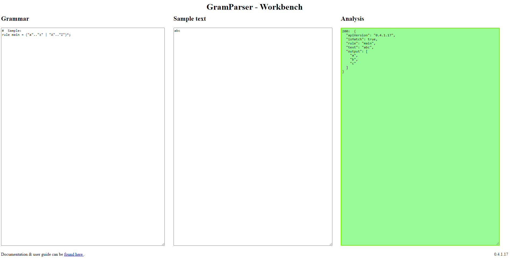

# Tutorial

Let's implement a simple DSL using [GramParser](https://github.com/vplauzon/GramParser).

We want to be able to read a configuration file of the form:

```Python
location = Canada
sizes = large, medium
nastier
=
elephant
,
prince
postal-code =
 K1P1J9
```

Let's say we can describe sample texts (in English) as follow:

* It is a list of configuration, arbitrarily long
* Each configuration is of the form ```config-key = config-element1, config-element2, ...``` where
  * ```config-key``` is an identifier starting with a letter and having any alpha-numeric character or minus ('-') afterwards
  * Config elements have similar format
  * Config elements can be either one element or multiple elements separated with commas
* Configurations typically occupy different line but that isn't necessary the case

Let's try to implement this with GramParser.  Let's fire up the [Workbench](https://workbench-gram-parser-jlv6prl7bdhpu.azurewebsites.net/).



The Workbench UI has three columns:

1. Grammar
1. Sample text
1. Analysis

We defined the grammar in the first column.  We input some sample text in the second column.  The third one gets populated automatically by applying the grammar on the sample text.

## Parsing a word

Let's start simple by parsing words.  Let's input the following in the *Grammar* text area (it should be there by default the first time we open the workbench):

```Python
#  Sample:
rule main = ("a".."z" | "A".."Z")*;
```

A grammar is a set of rules combined together.  The *main* rule is the one that gets fired to parse text. Using the NuGet package we can use different rule than the *main*.

Here our grammar stipulate that anything between "a" and "z" or "A" and "Z" is ok and can be repeated (arbitrarily long).  The '*' marks the repetition.

Let's type ```abc``` in the *Sample Text* area (this should be there by default the first time we open the workbench).  The *Analysis* should display the following:

```JSON
200:  {
  "apiVersion": "0.4.1.17",
  "isMatch": true,
  "rule": "main",
  "text": "abc",
  "output": [
    "a",
    "b",
    "c"
  ]
}
```

The sample ```abc``` does match our grammar:  it is a repetition of letters.

The **200** at the beginning of the analysis simply indicates the API HTTP status code.  **200** is HTTP for OK.

We see ``isMatch`` as *true* which indicates parsing was successful.  We see ``rule`` is *main*, i.e. that was the rule matched.

The ``output`` element contains parsing information.  In this case, it is simply a list of characters that were parsed.

Let's keep going.  If we change the *Sample Text* for ``abc1``, we'll see the *Analysis* turn red with the following message:

```JSON
200:  {
  "apiVersion": "0.4.1.17",
  "isMatch": false,
  "rule": null,
  "text": null,
  "output": null
}
```

This is because our grammar recognizes only letters, not numbers.  Let's fix that:

```Python
rule main = ("a".."z" | "A".."Z" | "0".."9")+;
```

We did a few modifications.

First we changed the '\*' for a '+'.  '+' indicates repeats of one or more while '\*' indicates repeats of **zero** or more.  That means '\*' accepts empty strings, which we do not want in this case.

Second we included numbers.  We use '|' to separate the sub rules.  It basically is a 'or':  either upper-case or lower-case or numbers.

We can now parse ``abc1``.

## Multiple rules

We would need to model identifiers, i.e. strings starting with a letter but following with either letter, numbers or '-'.  We could pack that into one rule, but let's use multiple rules to improve readability:

```Python
rule alpha = "a".."z" | "A".."Z";
rule alphaNumeric = alpha | "0".."9" | "-";
rule main = alpha alphaNumeric*;
```

The first rule defines letters-only while the second leverages the first and adds numbers and '-'.

The main rule builds a [sequence](primitives/sequence.md), i.e. different rules following each other:  first we match a letter then we match a repeat of alpha-numeric characters.  Notice we went back to '\*' since we force to have one character (a letter) first.

We can now match text such as ``test``, ``test2``, ``Test3-4`` but not ``6test`` (which starts with a numeric).

We notice the result gets pretty verbose pretty quickly.  We are going to address that.

## Parsing a configuration

We now have the knowledge to build a simple DSL:

```Python
rule alpha = "a".."z" | "A".."Z";
rule alphaNumeric = alpha | "0".."9" | "-";
rule identifier = alpha alphaNumeric*;

rule main = identifier "=" identifier;
```

With this grammar we can recognize configuration texts such as ``location=Canada`` (without spaces):

```JSON
200:  {
  "apiVersion": "0.4.1.17",
  "isMatch": true,
  "rule": "main",
  "text": "location=Canada",
  "output": [
    [
      "l",
      [
        "o",
        "c",
        "a",
        "t",
        "i",
        "o",
        "n"
      ]
    ],
    "=",
    [
      "C",
      [
        "a",
        "n",
        "a",
        "d",
        "a"
      ]
    ]
  ]
}
```

Before going any further, we'll tidy up the output.

## Output formarting

At the moment the first character is given first then an array of characters.  This is simply mimicking the combination of rules we defined.

In order to simplify this we can manipulate the [output](output) of the `identifier` rule:

```Python
rule alpha = "a".."z" | "A".."Z";
rule alphaNumeric = alpha | "0".."9" | "-";
rule identifier = alpha alphaNumeric* => text;

rule main = identifier "=" identifier;
```

This gives the much tidier output:

```JSON
200:  {
  "apiVersion": "0.4.1.17",
  "isMatch": true,
  "rule": "main",
  "text": "location=Canada",
  "output": [
    "location",
    "=",
    "Canada"
  ]
}
```

The [text output rule](output/text.md) simply outputs the text that was captured by the rule.

There are more output rules as we'll see.  This is critical when we want to map the output to a .NET class.

## Tagging

Another thing we would like to do is to remove the `=` from the output.  It is redundant as it doesn't bring information to the output.

We can do that by using tagging in the main rule:

```Python
rule alpha = "a".."z" | "A".."Z";
rule alphaNumeric = alpha | "0".."9" | "-";
rule identifier = alpha alphaNumeric* => text;

rule main = key:identifier "=" element:identifier;
```

Tagging means giving a name to a sub rule.  Here we gave `key` and `element` to the two relevant sub rules of `main` and we didn't give any name to the sub rule recognizing `=`.  This gives us the following result:

```JSON
200:  {
  "apiVersion": "0.4.1.17",
  "isMatch": true,
  "rule": "main",
  "text": "location=Canada",
  "output": {
    "element": "Canada",
    "key": "location"
  }
}
```

In the case of the [sequence](primitives/sequence.md) rule, we can tag none, some or all sub rules.  By tagging some sub rules we automatically excludes the non-tagged rules out of the output, as we did here with the `=`.

## Interleaves

Before we add more rules, it is important to notice an important shotcoming of our grammar:  it doesn't allow for spaces.  If we input ``location= Canada`` as sample text, our grammar won't match anything.

We could go sprinkle them in the sequence rule.  That would add noise in the existing rules quickly though.

Instead, we'll use a native feature of *GramParser*:  [interleave](interleave.md) rule.

Interleave is a special rule that defines what consist of meaningless spaces in our grammar, i.e. pieces of text that should be ignored.

We could simply add ``interleave = " ";`` on top of our grammar and ``location= Canada`` would now match.  So would ``location    =   Canada``.  That is, spaces are now ignored.

The issue with this is that now ``l ocation=Canada`` is also a match.  We do not want spaces to be ignored everywhere.  For that we can use rule parameters:

```Python
interleave = " ";
rule(interleave=false) alpha = "a".."z" | "A".."Z";
rule(interleave=false) alphaNumeric = alpha | "0".."9" | "-";
rule(interleave=false) identifier = alpha alphaNumeric* => text;

rule main = key:identifier "=" element:identifier;
```

Here we use the parameter *interleave* to say that the first three rules do not accept interleave.  Again, this is typical of *tokens*.

``l ocation=Canada`` doesn't match anymore.

The last rule (i.e. *main*) does accept interleave (the default) and this is why ``location  =  Canada`` is matched.

In some discussion around grammar, rules having `interleave=false` would be called *tokens*.

### Using interleaves for comments

We can use interleaves to implement *comments* in a DSL (unless comments should be captured in the parsing).  Let's use C++-style comments, ie. *//*:

```Python
rule(interleave=false) comment = "//" (. - ("\r" | "\n"))*;
interleave = " " | "\r" | "\n" | "\t" | comment;

rule(interleave=false) alpha = "a".."z" | "A".."Z";
rule(interleave=false) alphaNumeric = alpha | "0".."9" | "-";
rule(interleave=false) identifier = alpha alphaNumeric* => text;

rule main = key:identifier "=" element:identifier;
```

The first rule defines a comment:  something starting with two forward slash followed by *anything* except carriage return.  The rule `.` matches anything.

The second rule is the interleave rule where we now say that spaces, carriage return, tabs and comments are interleaves.

We can now match the following text:

```Csharp
location  =  // My first line
Canada
```

### Comma separated list

Let's extend our grammar to include a comma separated list a list of configuration elements.

A list is basically a lead element followed by an arbitrary long sequence of comma + element.  We essentially will use a head / tail approach to that type of list.

```Python
rule(interleave=false) comment = "//" (. - ("\r" | "\n"))*;
interleave = " " | "\r" | "\n" | "\t" | comment;

rule(interleave=false) alpha = "a".."z" | "A".."Z";
rule(interleave=false) alphaNumeric = alpha | "0".."9" | "-";
rule(interleave=false) identifier = alpha alphaNumeric* => text;

rule identifierList = head:identifier tail:("," id:identifier)*;

rule main = key:identifier "=" elementList:identifierList;
```

We can then have the following text matched ``sizes = large, medium, small``:

```JSON
200:  {
  "apiVersion": "0.4.1.17",
  "isMatch": true,
  "rule": "main",
  "text": "sizes = large, medium, small",
  "output": {
    "elementList": {
      "tail": [
        {
          "id": "medium"
        },
        {
          "id": "small"
        }
      ],
      "head": "large"
    },
    "key": "sizes"
  }
}
```

Although this grammar works, the output is a little ackward.  The head and tail are an *implementation detail* we would prefer not to surface in the output.  This could easily be done using the [prepend](output/functions/prepend.md):

```Python
rule(interleave=false) comment = "//" (. - ("\r" | "\n"))*;
interleave = " " | "\r" | "\n" | "\t" | comment;

rule(interleave=false) alpha = "a".."z" | "A".."Z";
rule(interleave=false) alphaNumeric = alpha | "0".."9" | "-";
rule(interleave=false) identifier = alpha alphaNumeric* => text;

rule identifierList = head:identifier tail:("," id:identifier => id)* => prepend(head, tail);

rule main = key:identifier "=" elementList:identifierList;
```

We also used an *inline* output rule so that `tail` becomes a simple array (as opposed to an array of objects with an `id` property).

We see that we get all the information elements we need and not more.

```JSON
200:  {
  "apiVersion": "0.4.1.17",
  "isMatch": true,
  "rule": "main",
  "text": "sizes = large, medium, small",
  "output": {
    "elementList": [
      "large",
      "medium",
      "small"
    ],
    "key": "sizes"
  }
}
```

### Putting it altogether

The last thing we need to do is to accept a list of configuration:

```Python
rule(interleave=false) comment = "//" (. - ("\r" | "\n"))*;
interleave = " " | "\r" | "\n" | "\t" | comment;

rule(interleave=false) alpha = "a".."z" | "A".."Z";
rule(interleave=false) alphaNumeric = alpha | "0".."9" | "-";
rule(interleave=false) identifier = alpha alphaNumeric* => text;

rule identifierList = head:identifier tail:("," id:identifier => id)* => prepend(head, tail);
rule configuration = key:identifier "=" elementList:identifierList;

rule main = configuration+;
```

We can now match the following text:

```
location = Canada
sizes = large, medium
nastier
=
elephant
,
prince
postal-code =
 K1P1J9
```

with the following result:

```JSON
200:  {
  "apiVersion": "0.4.1.17",
  "isMatch": true,
  "rule": "main",
  "text": "location = Canada\nsizes = large, medium\nnastier\n=\nelephant\n,\nprince\npostal-code =\n K1P1J9",
  "output": [
    {
      "elementList": [
        "Canada"
      ],
      "key": "location"
    },
    {
      "elementList": [
        "large",
        "medium"
      ],
      "key": "sizes"
    },
    {
      "elementList": [
        "elephant",
        "prince"
      ],
      "key": "nastier"
    },
    {
      "elementList": [
        "K1P1J9"
      ],
      "key": "postal-code"
    }
  ]
}
```

###  Using the NuGet package

So far we've quickly built our grammar using the workbench.  Chances are we want to use the grammar in an application / API.

To keep the tutorial short we won't do it here.  But consult the [SDK for details](sdk).

###  Next steps

We did a quick tour of the features of GramParser.  We didn't look at everything though.

There are a few more nuances in the grammar language, for instance recursivity wasn't covered here.

We suggest to go through the [online documentation](README.md) to learn more about GramParser.
